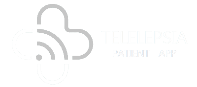
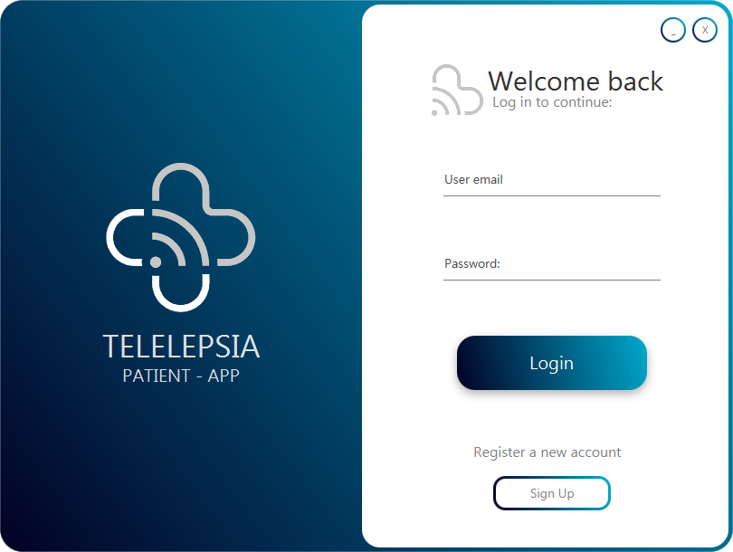
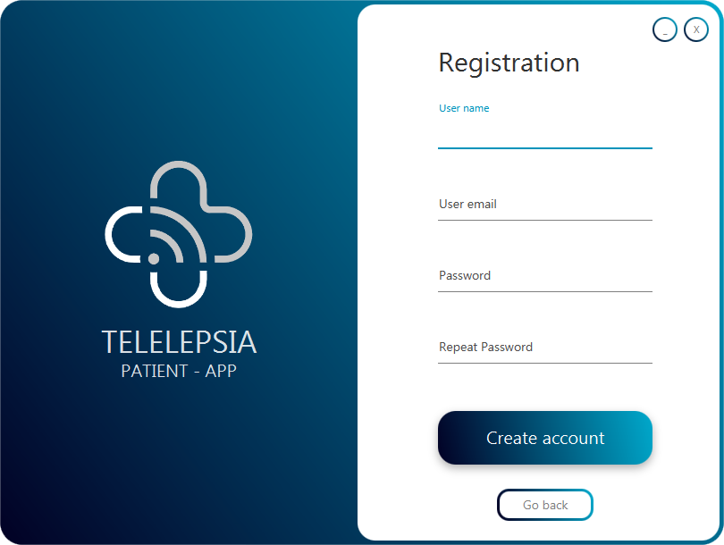
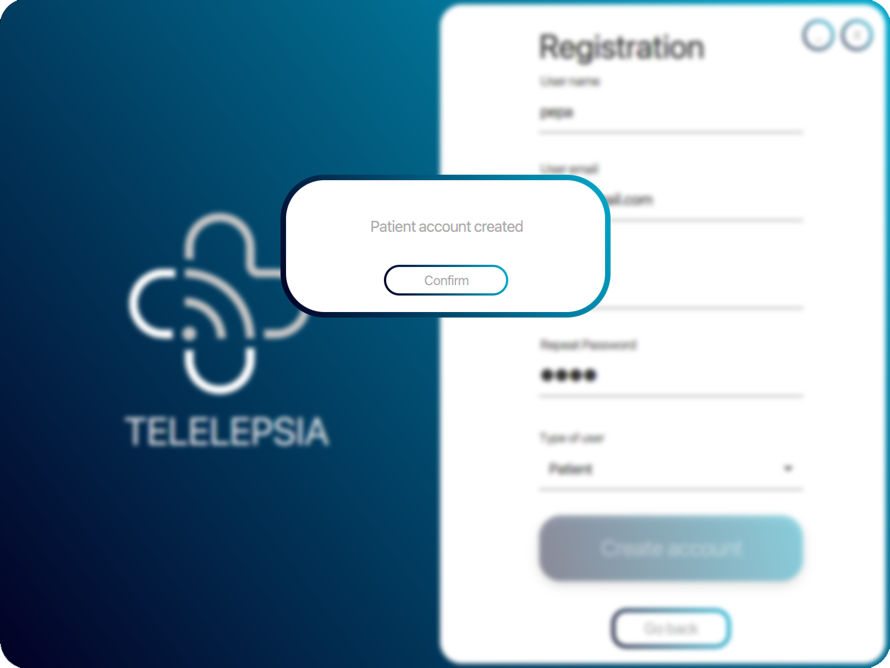
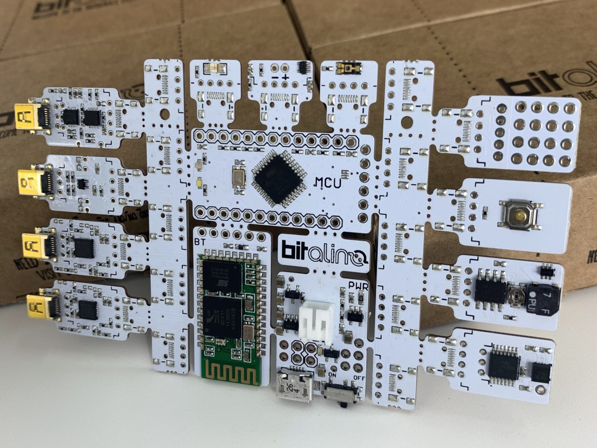
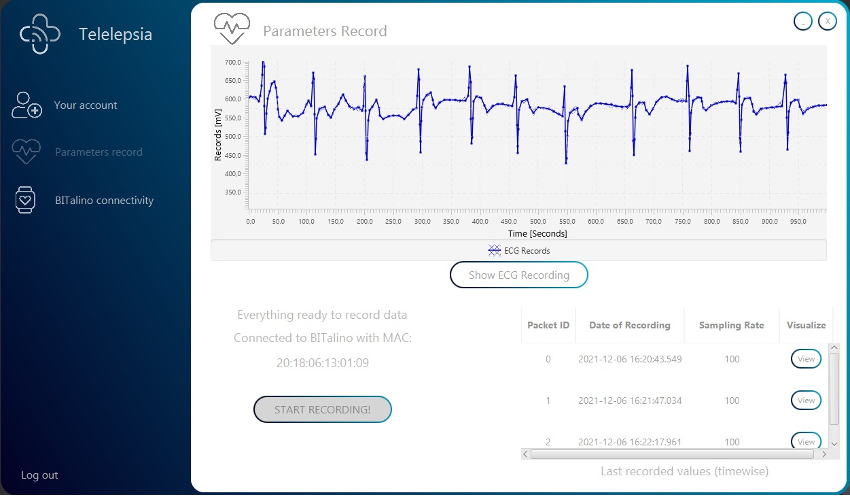

# Telelepsia Patient Desktop App
## Telemedicine Project (Java 11)

  

-------------------------------

### Index

1. Introduction
2. About the Project
3. Project Set-Up 
3. Patient Manual

-------------------------------
-------------------------------

## 1. Introduction

This is part of a teledicine project together with two other repositories whose purpose is the supervision from the patient’s home of a chronic disease, in our case Epilepsy. This part of the project is the desktop Java application used by a patients to recrod their data (ECG and EMG) using a BITalino which is then stored in a remote server.

### Project Repositories

1. Telemedicine-Doctor-Desktop-App: https://github.com/MiguelOteo/Telemedicine-Doctor-Desktop-App
2. Telemedicine-Patient-Desktop-App: https://github.com/MiguelOteo/Telemedicine-Patient-Desktop-App
3. Telemedicine-Rest-API: https://github.com/MiguelOteo/Telemedicine-Rest-API

-------------------------------
-------------------------------

## 2. About the Project

### About the programming languages

* Java, version 11 to use more updated libraries
* FXML for the layout files
* XML in the pom.xml for maven project structure, dependencies and compilation process

### About the operation system
This application can run in every operation system (Windows, OSX, Linux...) but the connection with BITalino only works in Windows, becasue the libraries. If this program will run in a Doctor computer this will not be a problem, but if the program need the BITalino connection to register data, as in Patients computers, only can be used with Windows.

### About the BITalino
There is a Library needed for the BITalino connection "bluecove-2.1.1.jar". (For Windows).

### JavaFX Project Maven dependencies

This project uses the following Maven dependencies

1. gson dependency: https://mvnrepository.com/artifact/com.google.code.gson/gson
2. json dependency: https://mvnrepository.com/artifact/org.json/json
3. jfoenix 9.0.1 dependency: https://mvnrepository.com/artifact/com.jfoenix/jfoenix/9.0.1
4. bluecove 2.1.1 dependency: https://mvnrepository.com/artifact/io.ultreia/bluecove/2.1.1
5. chartfx-chart 11.5.1 dependency: https://mvnrepository.com/artifact/de.gsi.chart/chartfx-chart/11.1.5
6. slf4j-simple 2.0.0-alpha0 dependency: https://mvnrepository.com/artifact/org.slf4j/slf4j-simple/2.0.0-alpha0
7. controlsfx 11.1.0 dependency: https://mvnrepository.com/artifact/org.controlsfx/controlsfx/11.1.0

-------------------------------
-------------------------------

## 3. Project Set-Up and compilation

### Project Set-Up

#### On Eclipse
The repository constains the .classpath file from Eclipse IDE, this project should build itself when opened with this IDE without any additional steps.

#### On other IDEs
There could be problems with the structure of the project when opened from a different IDE, you might need to stablish the structure of the project manually.

### Porject compilation

The pom.xml file is designed to compile the project into a fat-jar constaining all the dependencies needed for the project to work, remember that the project will only run on Java 11 or newer.

-------------------------------
-------------------------------

## 4. Patient Manual  

### 1. Log-in and Registration of users (Patients)
#### 1.1. Log-in View
When loading the application the user will see a log-in view to access their accounts, the application checks for a valid password and email.

  

#### 1.2. Registration View
If the user does not have an account they can create one by clicking on the button "sign up", if so a new view will appear for the user to register himself, the application checks all the parameter to not be empyty and to have the correct format.

  

Once the account parameters have been introduced and validated by the server before storing them as a new user in the data-base, a message pop-up will show up to indicate the result of the request to the server. This will return a message like "Patient account created" or an error like "User already exists" if the email was used already as it can be seen in the next image.

  

------

Before the application installation and the use of it, it's important to say to the patient that something to bear in mind is that this system has a Hardware dependency; this application works with the BITalino board to recover physiological data of the patient.

  

  

-------------------------------
### 2. Main application menu 
#### 2.1. Insert Patient ID View
Once the user logs-in a pop-up will be displayed for the doctor to identify himself as a real patient, in this case the ID uses the format of 8 digits and a letter form a list, in reality this ID should be verify aginst a hospital or institutional data-base to validate the patient's authenticity. This pop-up will show up everytime the patient logs-in until a valid ID is inserted, this blocks the application from continuing blocking the access to the application information.

  

  

6. [**BITalino Connection**]
 If everything has gone well, you are now in the main window of the patient. Here you can do a lot of things, but, if it is the first time that you enter you must connect your BITalino board to the application.  
 In this process you should have your BITalino board in hand, and follow the next steps:  
 6.1 Switch on the board.
 6.2 Enter into the BITalino Connection in Telelepsia Application.
 6.3 Wait 10 seconds while the program search BITalinos around you.
 6.4 Your BITalino should appear on the screen with its corresponding MAC address. 

  

  

7.[**BITalino Recording**]
To start to record your physiological data you have to connect your BITalino first. So if you don't, back to the last step to do it.
Once the BITalino is connected you must go to the "Parameters record" tab. At this moment you can click on the "START RECORDING" button, and the recorder process will start.

In this interface, you can observe the graph in the first half of the page and in the second one 2 spaces showing, in the fist one, our "START RECORDING" button to record the ECG, and, in the second space we can see a list with the information received from the BITalino in packet form and with a view button of each one to see the information of each packet received.

In the following screen shot we can observe data about an ECG patient test, but we can do the same patient test with an EMG.

  

  

If we click on the "Show ECG Recording" or in the "Show EMG Recording" button we can see the graph with better resolution and we can zoom it.
