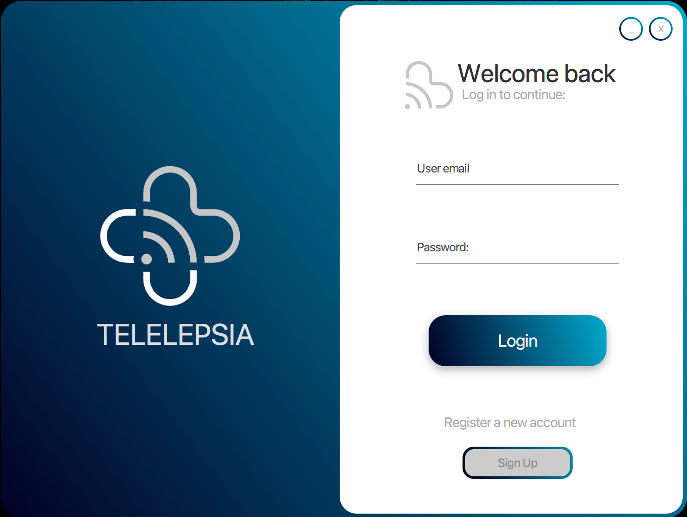
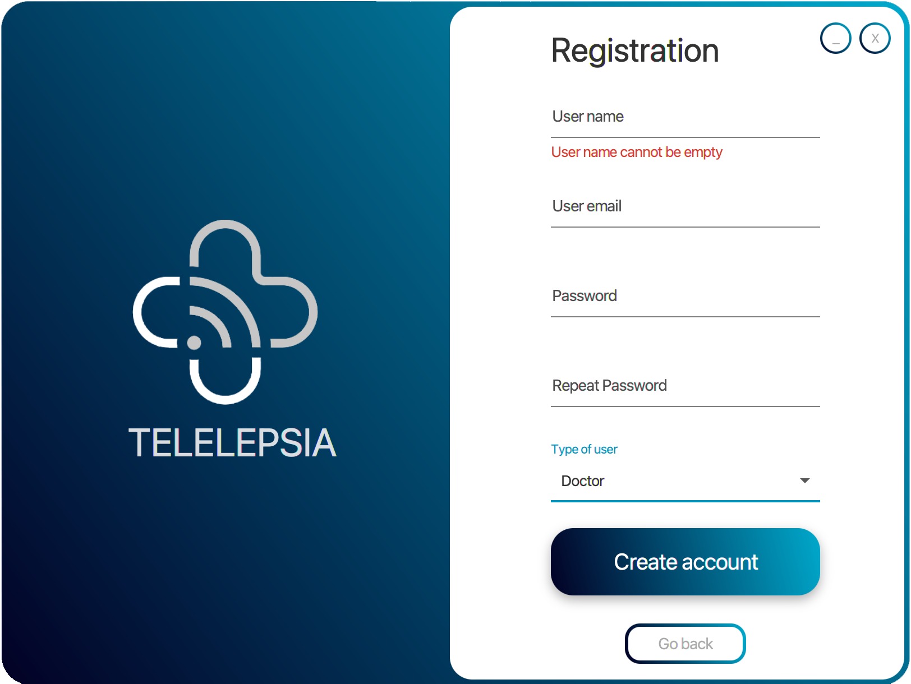

# Telelepsia  
## TelemedicineProject (Java 11)

  

-------------------------------

### Index

1. Introduction
2. Admin & Installation Manual.
3. User Manual.  
3.1 Doctor Manual.  
3.2 Patient Manual.

-------------------------------

## 1. Introduction

This project is a telemedicine application whose purpose is the supervision from the patient’s home of a chronic disease.

The application works recieving data from a BITalino and sending it to a MySQL data base by a connection stablished with a Rest API ([Link to the Rest API used in the project, click on me](https://github.com/MiguelOteo/TelemedicineRestAPI)), as well as allowing the user to create two possible accounts, patients which send the BITalino bio-data and doctors who can see the stored patient's data.

It is important to emphasize that this project works together with TelemedicineRestAPI project, which link has been written previously. 

----------------------------------------

## 2. Admin & Instalation Manual

## JavaFX Project Maven dependencies

This project uses the following Maven dependencies

1. gson dependency: https://mvnrepository.com/artifact/com.google.code.gson/gson
2. json dependency: https://mvnrepository.com/artifact/org.json/json
3. jfoenix 8.0.8 dependency: https://mvnrepository.com/artifact/com.jfoenix/jfoenix

-----------------------------------------

## 3. User Manual  

Once everything has been downloaded, installed and works properly, you only have to run the project and one window with a friendly user interface will be opened, as the following:

  

Depending on your role you can interact with the application in a different way, you can use the application as a Doctor or as a Patient.

### 3.1 Doctor Manual:

1. If you haven't got an account created yet, you have to click in the "Sign Up" button, to register a new account. 

2. Once you clicking on the button a new tab is shown requesting to know some data to create the new account. It's important to bear in mind that every bound must be filled with the data required.

  

