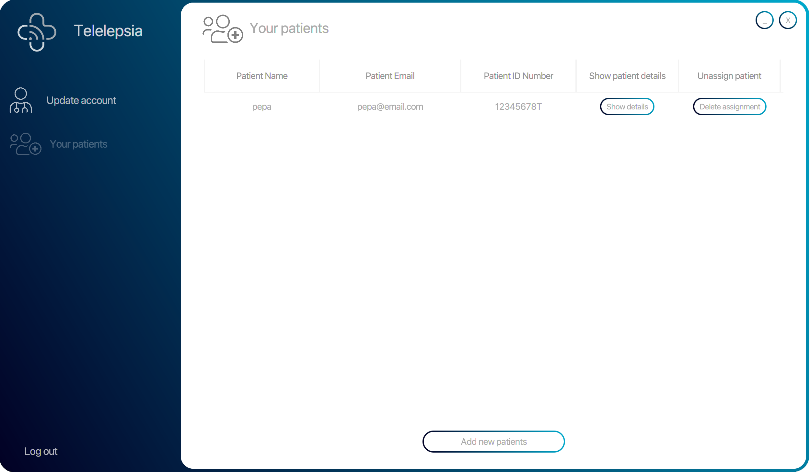
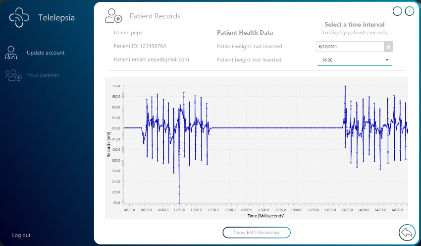

# Telelepsia  
## TelemedicineProject (Java 11)

  

-------------------------------

### Index

1. Introduction
2. Admin & Installation Manual.
3. User Manual.  
3.1 Doctor Manual.  
3.2 Patient Manual.

-------------------------------

## 1. Introduction

This project is a telemedicine application whose purpose is the supervision from the patient’s home of a chronic disease, in our case Epilepsy.

The application works recieving data from a BITalino and sending it to a MySQL data base by a connection stablished with a Rest API ([Link to the Rest API used in the project, click on me](https://github.com/MiguelOteo/TelemedicineRestAPI)), as well as allowing the user to create two possible accounts, patients which send the BITalino bio-data and doctors who can see the stored patient's data.

It is important to emphasize that this project works together with TelemedicineRestAPI project, which link has been written previously. 

----------------------------------------

## 2. Admin & Instalation Manual

### About the programming languages:

* Java, version 11 to use more updated libraries
* JavaFX with FXML for the UI design
* SQL for the database structure and queries 
* XML for the web.xml in the RestAPI and the pom.xml of both the app and the RestAPI maven projects

### About the Data Base:
The database is managed by MySQL which is an open-source relational database management system (RDBMS). Which uses SQL, the abbreviation for Structured Query Language. 

### About the Server:
Apache Tomcat is a free and open-source implementation of the Jakarta Servlet, Jakarta Expression Language, and WebSocket technologies. Tomcat provides a "pure Java" HTTP web server environment in which Java code can run. 

Catalina is Tomcat's servlet container which will be used to run the servlets of the RestAPI

### About the operation system:
This application can run in every operation system (Windows, OSX, Linux...) but the connection with BITalino only works in Windows, becasue the libraries. If this program will run in a Doctor computer this will not be a problem, but if the program need the BITalino connection to register data, as in Patients computers, only can be used with Windows.

### About the BITalino:
There is a Library needed for the BITalino connection "bluecove-2.1.1.jar". (For Windows).

## JavaFX Project Maven dependencies

This project uses the following Maven dependencies

1. gson dependency: https://mvnrepository.com/artifact/com.google.code.gson/gson
2. json dependency: https://mvnrepository.com/artifact/org.json/json
3. jfoenix 9.0.1 dependency: https://mvnrepository.com/artifact/com.jfoenix/jfoenix/9.0.1
4. bluecove 2.1.1 dependency: https://mvnrepository.com/artifact/io.ultreia/bluecove/2.1.1
5. chartfx-chart 11.5.1 dependency: https://mvnrepository.com/artifact/de.gsi.chart/chartfx-chart/11.1.5
6. slf4j-simple 2.0.0-alpha0 dependency: https://mvnrepository.com/artifact/org.slf4j/slf4j-simple/2.0.0-alpha0
7. controlsfx 11.1.0 dependency: https://mvnrepository.com/artifact/org.controlsfx/controlsfx/11.1.0

-----------------------------------------
-----------------------------------------

## 3. User Manual  

Once everything has been downloaded, installed and works properly, you only have to run the project and one window with a friendly user interface will be opened, as the following:

  

Depending on your role you can interact with the application in a different way, you can use the application as a Doctor or as a Patient.

-----

### 3.1 Doctor Manual:

1. If you haven't got an account created yet (keep reading, in the other case go to step 4), you have to click in the "Sign Up" button, to register a new account. 

2. Once you clicking on the button a new tab is shown requesting to know some data to create the new account. It's important to bear in mind that every bound must be filled with the data required. After all was be completed you can click on the "Create account" button.

  

  

3.  After all were being completed, you can click on the "Create account" button and a message will appear, indicating that the Doctor account have been created, that's mean that everything goes successfully.

  

  

4. Once, you, as a Doctor, have an account created you can proceed to do the "Login" process, in the main menu. You only have to introduce your email and the password introduced in the "Sign up" process.

5. When you are in, a Doctor number identification is required. This is the id that each Doctor must to have as a professional. The identification number consists of 8 digits following by a capital letter.  
For example: "12345678L".

  

  

6. [**Modify Own Data**]After introducing your Doctor number identification a workspace is shown, where you can do a variety of actions; for example update your initial data proportioned when you sign up, or change the password often as a good cybersecurity custom. You can see your actual information below the doctor picture.

  

  

7. [**Monitoring Patients Physiological Paramenters**]
To monitor the physiological data of a patient you must add it to your control patients panel, in the "Your patients" view. To do that click on "Add new patients" button, and a new window will be opened.

  

 

  

 

There you can select the patients that you want, which will be marked with a tick. When you finish the selection process, click on "Add selected patients" button and the patients will be added. When you have finished, click on cancel operation to exit from the selection window.

Once you close the selection window you can see the patients that you have selected in "Your patients" view.  

In case that you don't want any patient you can click on "Delete assignment" button, and this patient will be removed from your patients.

  

 

If we click on "Show details" button we can see all the information about our patient and her physiological parameters recorded.

  

  

------

### 3.1 Patient Manual:

Before the application installation and the use of it, it's important to say to the patient that something to bear in mind is that this system has a Hardware dependency; this application works with the BITalino board to recover physiological data of the patient.

  

  

1. If you haven't got an account created yet (keep reading, in the other case go to step 4), you have to click in the "Sign Up" button, to register a new account. 

2. Once you clicking on the button a new tab is shown requesting to know some data to create the new account. It's important to bear in mind that every bound must be filled with the data required. After all was be completed you can click on the "Create account" button.

  

  

3.  After all were being completed, you can click on the "Create account" button and a message will appear, indicating that the Patient account have been created, that's mean that everything goes successfully.

  

  

4. Once, you, as a Patient, have an account created you can proceed to do the "Login" process, in the main menu. You only have to introduce your email and the password introduced in the "Sign up" process.

5. When you are in, a Health Insurance number  is required. This is the id that each Patient must to have as a part of a society with healthcare system. The Health Insurance number consists of 8 digits following by a capital letter.  
For example: "12345678T".

  

  

6. [**BITalino Connection**]
 If everything has gone well, you are now in the main window of the patient. Here you can do a lot of things, but, if it is the first time that you enter you must connect your BITalino board to the application.  
 In this process you should have your BITalino board in hand, and follow the next steps:  
 6.1 Switch on the board.
 6.2 Enter into the BITalino Connection in Telelepsia Application.
 6.3 Wait 10 seconds while the program search BITalinos around you.
 6.4 Your BITalino should appear on the screen with its corresponding MAC address. 

  

  

7.[**BITalino Recording**]
To start to record your physiological data you have to connect your BITalino first. So if you don't, back to the last step to do it.
Once the BITalino is connected you must go to the "Parameters record" tab. At this moment you can click on the "START RECORDING" button, and the recorder process will start.

In this interface, you can observe the graph in the first half of the page and in the second one 2 spaces showing, in the fist one, our "START RECORDING" button to record the ECG, and, in the second space we can see a list with the information received from the BITalino in packet form and with a view button of each one to see the information of each packet received.

In the following screen shot we can observe data about an ECG patient test, but we can do the same patient test with an EMG.

  

  

If we click on the "Show ECG Recording" or in the "Show EMG Recording" button we can see the graph with better resolution and we can zoom it.
